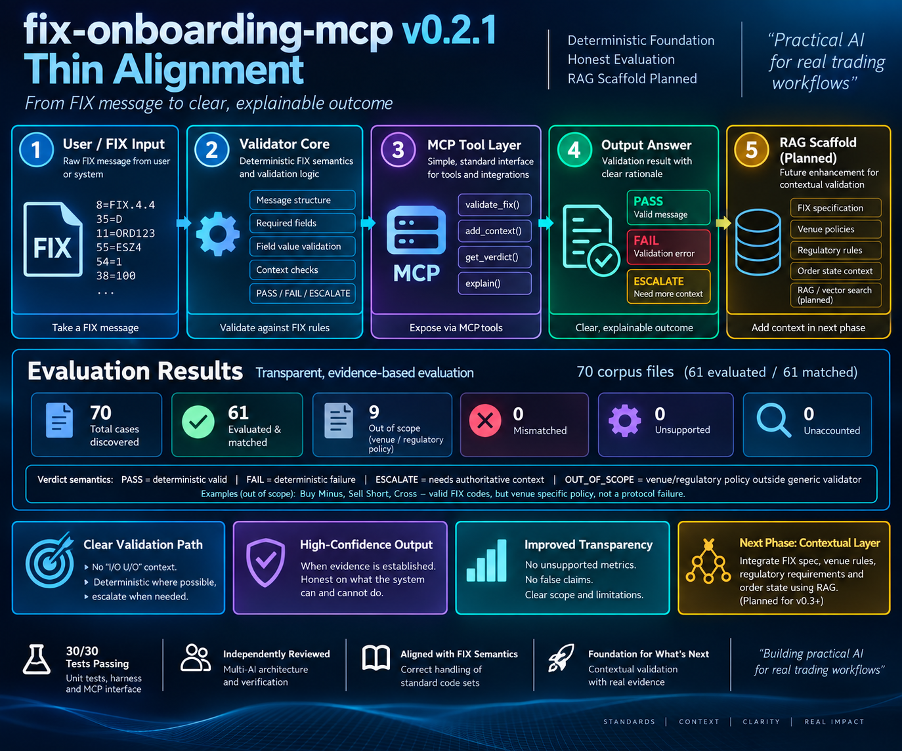

# FIX Onboarding Validator - MCP Server

A prototype FIX onboarding validation system combining deterministic FIX
validation, explicit contextual authority, an MCP interface, LangGraph workflow
components, and an executable golden-set evaluation harness.

The project is focused on building practical, explainable AI-assisted tooling
for real electronic-trading and FIX onboarding workflows.

---

## Current Architecture & Validation Flow

The diagram above represents the thin-alignment architecture from the earlier
design phase. The executable implementation has since added an initial
contextual-validation slice while retaining the same deterministic foundation.

The current validation path separates:

    FIX message
         |
         v
    Parse / classify
         |
         v
    Deterministic FIX protocol validation
         |
         +---- protocol failure ------> FAIL / PROTOCOL
         |
         v
    Explicit validation context
         |
         +---- authority unavailable -> ESCALATE / AUTHORITY
         |
         v
    Deterministic venue policy
         |
         +---- policy failure --------> FAIL / POLICY
         |
         v
    Structured deterministic decision
         |
         v
    LLM explanation

The deterministic decision is the freeze-point. The LLM may explain the result,
but it does not own or mutate the PASS / FAIL / ESCALATE verdict.

The current contextual implementation is deliberately narrow. It proves the
authority boundary using an explicit VENUE_X Side policy rather than attempting
to implement every venue or regulatory rule at once.

RAG remains outside the deterministic verdict path.

---

## Current Implementation

### Deterministic FIX Validation

The validator currently supports deterministic validation for selected FIX
message workflows, including:

- NewOrderSingle (`35=D`)
- ExecutionReport (`35=8`)
- Cancel/Replace (`35=G`) contextual validation
- FIX delimiters using SOH, pipe, or caret input
- explicit PASS / FAIL / ESCALATE verdict semantics
- explicit decision provenance using PROTOCOL / POLICY / AUTHORITY
- explicit contextual venue Side validation

Generic FIX protocol validity is intentionally separated from venue-specific
and regulatory policy.

For example, FIX Side (`54`) value `3` is a recognised standard Side value
(`Buy Minus`). It is therefore not rejected merely because an individual venue
may permit only a subset of the standard Side values.

Without explicit venue context, Side `3` is evaluated as generic FIX protocol
and may PASS.

With explicit VENUE_X context, the current example venue profile permits Side
values `1`, `2`, and `5`. Side `3` therefore produces a deterministic policy
FAIL rather than a generic protocol failure.

### Explicit Authority Boundary

Contextual policy is activated only through explicit caller-supplied validation
context.

For example:

    ValidationContext(venue_id="VENUE_X")

FIX CompID fields such as TargetCompID (`56`) are message data. They do not
automatically acquire authority to select a venue-policy profile.

This means:

- Side `54=3` with no explicit context -> PASS / PROTOCOL
- Side `54=3` with `56=VENUE_X` only -> PASS / PROTOCOL
- Side `54=3` with explicit VENUE_X context -> FAIL / POLICY
- Side `54=1` with explicit VENUE_X context -> PASS / POLICY
- protocol-invalid Side `54=Z` -> FAIL / PROTOCOL
- valid protocol with an explicitly requested unknown venue -> ESCALATE / AUTHORITY

Protocol validation runs before contextual policy evaluation. A protocol-invalid
message is therefore not converted into an authority escalation merely because
an unknown venue context was also supplied.

### Verdict Semantics

The current validation model distinguishes between:

- **PASS** - deterministic evidence establishes validity
- **FAIL** - deterministic evidence establishes a validation failure
- **ESCALATE** - authoritative context is required before PASS or FAIL can be established

`OUT_OF_SCOPE` is separate from runtime validation verdicts. It is an evaluation
classification for corpus cases whose required policy is not currently
implemented.

### Decision Provenance

NewOrderSingle validation also records the layer responsible for the decision:

- **PROTOCOL** - generic deterministic FIX validation
- **POLICY** - deterministic contextual policy validation
- **AUTHORITY** - required explicit authority is unavailable

This makes the reason a verdict exists visible to downstream callers rather than
exposing only a boolean result.

---

## MCP Interface

`mcp_server.py` exposes validation functionality through the Model Context
Protocol.

The MCP interface retains the existing boolean `valid` result for backward
compatibility while exposing the explicit `verdict` and NewOrderSingle
`decision_layer`.

For contextual NewOrderSingle validation, callers may explicitly provide a
`venue_id`. The MCP layer constructs validation context only when that explicit
authority is supplied.

TargetCompID (`56`) alone does not activate venue policy through MCP.

The boolean invariant remains:

- PASS -> `valid = true`
- FAIL -> `valid = false`
- ESCALATE -> `valid = false`

This provides a simple interface for tools, workflows and AI agents without
weakening the deterministic validation boundary.

---

## LangGraph and LLM Explanation

`langgraph_agent.py` and `langgraph_agent_with_llm.py` provide lightweight
LangGraph workflow prototypes.

The LLM-enhanced workflow currently attempts a local Ollama request using the
`llama3.2` model for explanation.

Before the LLM explanation stage, deterministic validation state is preserved,
including:

- `valid`
- `verdict`
- `decision_layer`
- validation errors

The LLM receives the deterministic result as context for explanation. It does
not determine the validation verdict.

An executable safety test deliberately mocks an LLM response that claims an
invalid FIX order is valid. The deterministic state remains FAIL / PROTOCOL,
demonstrating that contradictory generated text cannot mutate the frozen
validation decision.

If Ollama is unavailable, the workflow falls back to a deterministic
explanation.

This is a prototype workflow, **not a production-ready multi-provider agent**.

---

## Evaluation

The canonical evaluation corpus is stored under `golden_set/` and currently
contains **70 corpus files**:

- 25 valid NewOrderSingle cases
- 25 invalid NewOrderSingle cases
- 20 Cancel/Replace edge cases

Current executable harness result:

- **Discovered:** 70
- **Evaluated:** 64
- **Out of scope:** 6
- **Unsupported:** 0
- **Matched:** 64
- **Mismatched:** 0
- **Unaccounted:** 0

The six remaining out-of-scope cases are:

- 3 VENUE_FIRMUP_POLICY cases
- 3 REGULATORY_LEI_POLICY cases

Three VENUE_SIDE_POLICY cases that were previously out of scope are now
executed using explicit caller-supplied validation context.

The evaluation harness does not infer authority from FIX CompID fields or from
descriptive corpus metadata such as a `venue` field. Contextual policy is
activated only by explicit `validation_context`.

The corpus contains parametrically repeated cases, so **70 corpus files should
not be interpreted as 70 independent validation scenarios**. Corpus size and
decision-boundary coverage are different measurements.

Run the evaluation harness with:

    python -m eval.harness

Run the complete unit-test suite with:

    python -m unittest discover -v

Current local verification:

- **46/46 tests passing**
- **64/64 evaluated corpus cases matched**
- **0 mismatches**
- **0 unsupported**
- **0 unaccounted**

---

## Evaluation Philosophy

The alignment and contextual-validation work on this project reinforced an
important engineering principle:

> A green benchmark does not necessarily mean correct software.

An implementation, its unit tests and its golden dataset can all agree while
sharing the same incorrect assumption.

One example encountered during development involved FIX Tag 54 (`Side`).

The generic validator originally treated only a narrow subset of Side values as
valid. Review against FIX semantics showed that the standard Side code set is
broader.

A venue may restrict that standard set, but such a restriction is **venue
policy**, not generic FIX protocol validity.

The implementation and evaluation corpus were therefore aligned to the FIX
semantics rather than changing the software merely to satisfy the existing
benchmark.

### From Green Benchmark to Explained Correctness

Before contextual authority was implemented, the canonical harness reported:

- 61 evaluated
- 61 matched
- 9 out of scope
- 0 mismatched

That result was green, but the VENUE_SIDE_POLICY cases were outside the
executable authority-aware path.

Three Side-policy cases were then moved into executable scope with explicit
VENUE_X validation context.

Before the harness was changed to bind that explicit context, the evaluation
intentionally exposed three mismatches:

- 64 evaluated
- 61 matched
- 3 mismatched

The harness was then updated to construct validation authority only from the
case's explicit `validation_context`.

The final result became:

- 64 evaluated
- 64 matched
- 6 out of scope
- 0 mismatched

The important result is not merely that the benchmark became green again. The
system now reaches those contextual verdicts through the intended authority
boundary.

The project therefore treats **explained correctness** as more important than a
green score in isolation.

---

## RAG Status

`rag/fix_spec_rag.py` is currently a scaffold for a future contextual retrieval
layer.

RAG does not currently participate in the deterministic verdict path.

The repository does **not currently implement or measure**:

- vector retrieval
- BM25 or reciprocal-rank fusion (RRF)
- Qdrant
- CrossEncoder reranking
- RAGAS faithfulness
- retrieval/context precision
- model confidence thresholds
- retrieval latency benchmarks

These remain planned architecture rather than current evaluation results.

No numerical RAG, confidence or retrieval-performance claims should be inferred
from the current repository.

A future retrieval layer may provide knowledge, evidence and explanation, but
retrieval should not automatically acquire decision authority.

One possible future pattern is:

    venue / regulatory documents
              |
              v
         retrieval / extraction
              |
              v
         candidate policy
              |
              v
          human review
              |
              v
      structured policy profile
              |
              v
    deterministic validation

This keeps retrieval useful without allowing retrieved text to silently become
authoritative executable policy.

---

## Contextual / RAG Architecture - Design Direction

The diagram below is retained as an **architecture design artifact** from the
earlier RAG evaluation design.

It represents the intended direction for richer contextual knowledge and
validation capabilities and **should not be interpreted as evidence that all
depicted components are currently implemented**.

The project now distinguishes between:

**implemented deterministic/contextual validation -> scaffolded retrieval ->
planned richer contextual capability.**

The first contextual venue-policy slice is implemented using explicit
structured authority and deterministic policy data.

Future contextual work can expand this approach to:

- additional venue-specific onboarding profiles
- regulatory rule profiles
- authoritative order-state integration
- FIX specification retrieval
- client onboarding documentation
- context-grounded explanations
- measured RAG evaluation

Future capabilities should continue to be introduced with explicit authority,
executable tests and measured evaluation rather than placeholder metrics.

---

## Multi-Model Engineering Approach

Development of the project uses multiple AI systems in complementary
engineering roles rather than treating them as competing sources of a single
answer.

The workflow has included AI-assisted:

- implementation
- architecture review
- debugging
- adversarial review
- evaluation review
- artifact verification

The important principle is that model agreement is **not** treated as evidence
by itself.

Where models disagree, the disagreement is used to expose assumptions for
further investigation.

Domain knowledge, authoritative specifications, executable tests and
engineering judgement remain the final basis for accepting changes into the
repository.

A simplified development loop is:

    AI-assisted implementation
             |
             v
      Architecture review
             |
             v
       Independent review
             |
             v
     Adversarial verification
             |
             v
       Executable evidence
             |
             v
     Human / domain decision

This approach is particularly useful in FIX and electronic-trading systems,
where apparently small semantic assumptions can materially change validation
behaviour.

---

## Engineering Principles

The project currently follows several principles that emerged from the
alignment and contextual-validation work:

1. **A green benchmark does not necessarily mean correct software.**
2. **Multiple models agreeing does not constitute evidence if they share the
   same assumptions.**
3. **Architecture intent is not implementation evidence.**
4. **Generic FIX semantics should not be conflated with venue policy.**
5. **Message data is not automatically decision authority.**
6. **Contextual authority should be explicit rather than inferred from
   identifiers such as CompIDs.**
7. **The deterministic decision must be frozen before probabilistic explanation.**
8. **An LLM may explain a verdict but must not silently mutate it.**
9. **Retrieval may supply knowledge and evidence without automatically acquiring
   decision authority.**
10. **A benchmark should expose the boundary of the system rather than pressure
    the implementation into pretending that boundary does not exist.**
11. **Evaluation metrics should only be presented as measured when an executable
    process actually produced them.**

---

## Project Structure

    fix-onboarding-mcp/
        assets/
            fix-onboarding-mcp-thin-alignment.png
        eval/
            harness.py
            EVAL_REPORT.md
        golden_set/
            EVAL_REPORT.md
            ...
        rag/
            fix_spec_rag.py
        fix_validator.py
        mcp_server.py
        langgraph_agent.py
        langgraph_agent_with_llm.py
        requirements.txt
        DEMO.md
        README.md

---

## Running Locally

Install the Python dependencies:

    pip install -r requirements.txt

Run the tests:

    python -m unittest discover -v

Run the canonical evaluation harness:

    python -m eval.harness

For the optional local LLM explanation prototype, see `DEMO.md`.

---

## Current Status

### Implemented

- deterministic FIX validation foundation
- PASS / FAIL / ESCALATE semantics
- PROTOCOL / POLICY / AUTHORITY decision provenance
- explicit ValidationContext authority boundary
- initial deterministic VENUE_X Side policy
- MCP validation interface with explicit contextual `venue_id`
- deterministic decision freeze-point before LLM explanation
- executable test proving the LLM cannot mutate a deterministic verdict
- canonical executable golden-set harness
- explicit evaluation scope boundaries
- contextual Cancel/Replace escalation
- FIX delimiter normalization
- standard FIX Side handling
- reproducible runtime dependency declarations

### Scaffolded

- contextual FIX specification retrieval interface
- lightweight LangGraph/LLM workflow prototypes

### Planned

- additional venue-profile validation
- FirmUp policy validation
- regulatory LEI/profile validation
- authoritative order-state integration
- hybrid retrieval
- reranking
- measured RAG evaluation
- broader independent scenario coverage

---

**Building practical AI for real trading workflows - with executable evidence,
explicit authority boundaries and honest evaluation.**