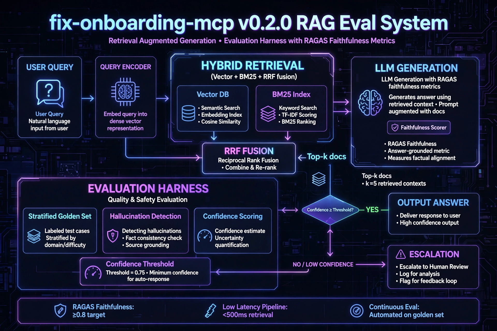

## Architecture: v0.2.0 RAG Eval System

**Hybrid Retrieval (Vector+BM25+RRF) + LLM Gen with RAGAS faithfulness ≥0.8**
**Stratified Eval Harness (golden set / hallucination / confidence 0.75) → Escalation**
Live release: v0.2.0-rag-eval (de7975b)
 
# FIX Onboarding Validator - MCP Server

An MCP server for validating FIX protocol onboarding, with a LangGraph agent for automated workflows.

## Features
- FIX Validator: Validates FIX messages against onboarding rules
- MCP Server: Exposes validation tools via Model Context Protocol
- LangGraph Agent: Autonomous agent that orchestrates the onboarding flow
- LLM-Enhanced Agent: Uses LLMs for intelligent parsing and error explanation

### FOM-4: LangGraph + LLM Integration - BETA v0.9

Status: Beta complete - running locally, production-ready architecture

Current Implementation (Beta):
- Model: Llama 3.1:8b via Ollama - local, free, no API key required
- 4-node LangGraph: detect_and_validate -> explain_with_llm -> report_pass/fail
- Factory pattern allows provider swapping via LLM_PROVIDER env var

Planned Production (Placeholder - Intentional):

    # In get_llm() factory:
    elif provider == "anthropic":
        # PLANNED - Testing in progress, requires billing
        return ChatAnthropic(model="claude-3-5-sonnet-20240620")

Why this design:
- Avoids API costs during dev while proving LLM integration works
- Extensible - same graph works with Anthropic, OpenAI, local models
- To switch to production: LLM_PROVIDER=anthropic + ANTHROPIC_API_KEY

Run Beta:

    ollama pull llama3.1:8b
    python langgraph_agent_with_llm.py

## Project Structure

    fix-onboarding-mcp/
        fix_validator.py
        langgraph_agent.py
        langgraph_agent_with_llm.py
        .env.example
        README.md
        requirements.txt

